# Projeto de Endereçamento IP e Camada de Rede

## 📌 Descrição

Este projeto foi desenvolvido com o objetivo de demonstrar, na prática, o funcionamento do endereçamento IP dentro da camada de rede. A atividade simula uma rede local simples, permitindo visualizar como ocorre a comunicação entre dispositivos em uma LAN.

A proposta também busca reforçar conceitos fundamentais de redes de computadores por meio de uma abordagem prática utilizando simulação.

---

## Objetivos

- Compreender o funcionamento do endereço IP
- Diferenciar IP público e privado
- Configurar manualmente uma rede local
- Testar conectividade entre dispositivos
- Aplicar conceitos da camada de rede (OSI)

---

## Conceitos Abordados

- Endereçamento IP
- Máscara de Sub-rede
- Gateway Padrão
- DNS
- Protocolo ICMP (Ping)
- Camada de Rede (Modelo OSI)

---

## Topologia da Rede

A rede foi composta por:

- 2 Computadores (PC1 e PC2)
- 1 Switch
- 1 Roteador

Os computadores foram conectados ao switch por meio de interfaces FastEthernet, enquanto o switch foi conectado ao roteador através de uma interface GigabitEthernet.

---

## Configuração de Rede

### PC1
- IP: 192.168.10.10
- Máscara: 255.255.255.0
- Gateway: 192.168.10.1

### PC2
- IP: 192.168.10.11
- Máscara: 255.255.255.0
- Gateway: 192.168.10.1

### Roteador
- Interface: GigabitEthernet0/0
- IP: 192.168.10.1
- Máscara: 255.255.255.0

---

## Configuração do Roteador

A configuração foi realizada via CLI com os seguintes comandos:

enable
configure terminal
interface gigabitEthernet 0/0
ip address 192.168.10.1 255.255.255.0
no shutdown

---

## Teste de Conectividade

A comunicação entre os dispositivos foi testada utilizando o comando `ping`, garantindo que os computadores conseguiam se comunicar corretamente dentro da rede.

---

## Evidências do Projeto

### Topologia da Rede
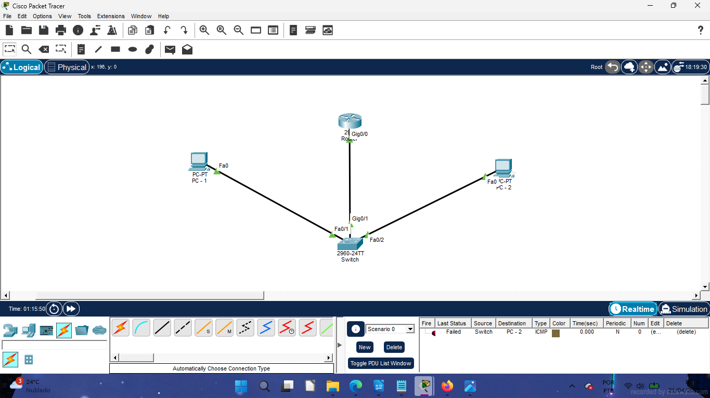
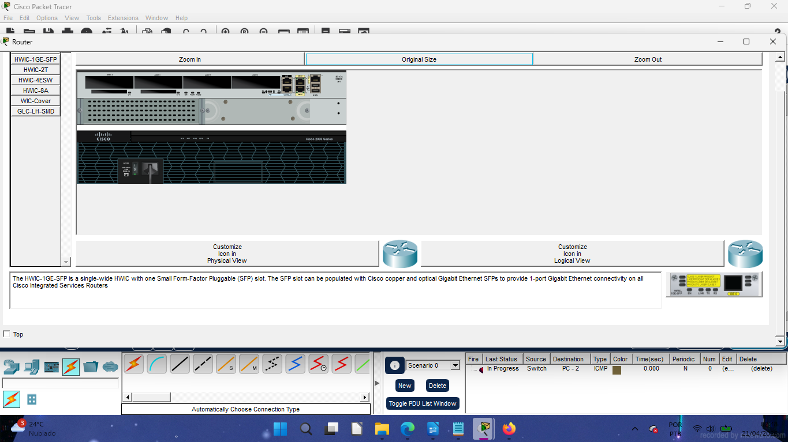
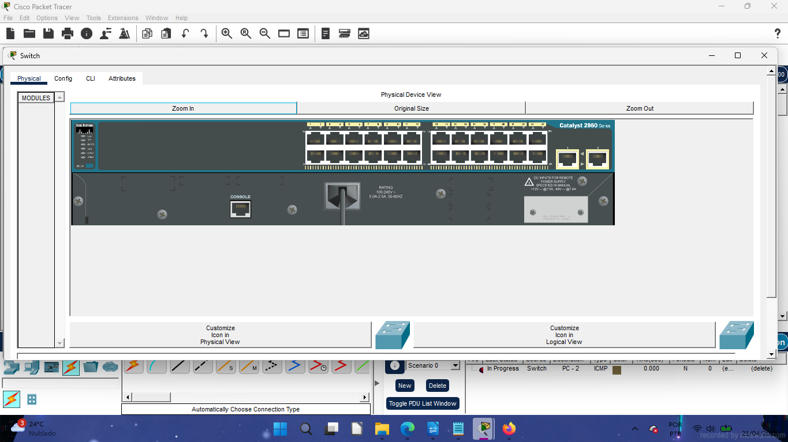
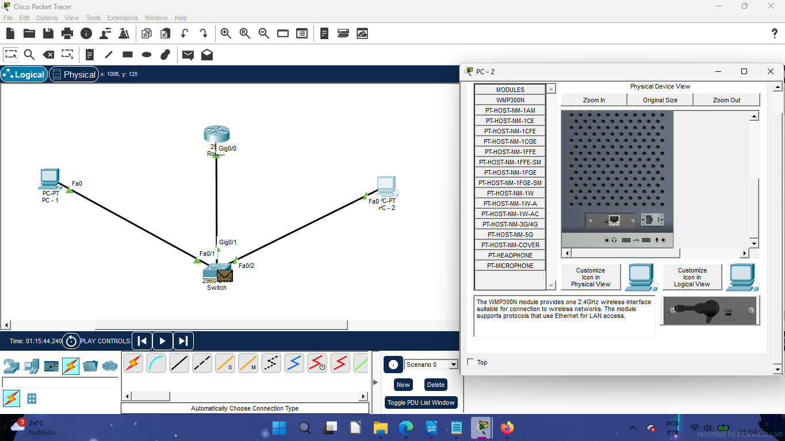
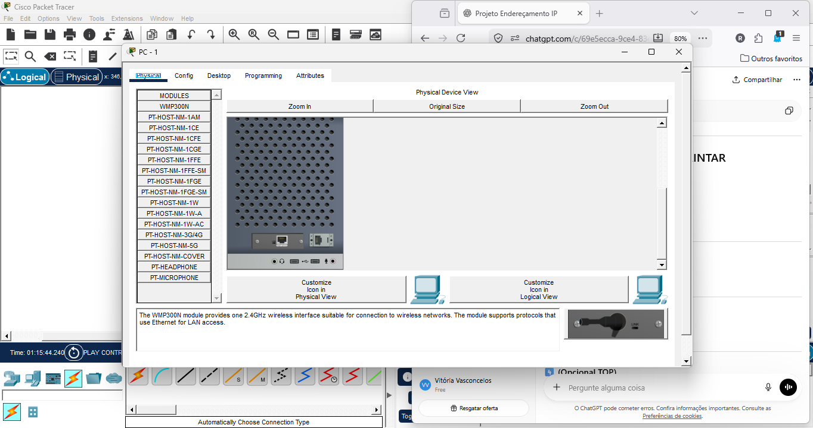

### Configuração de IP
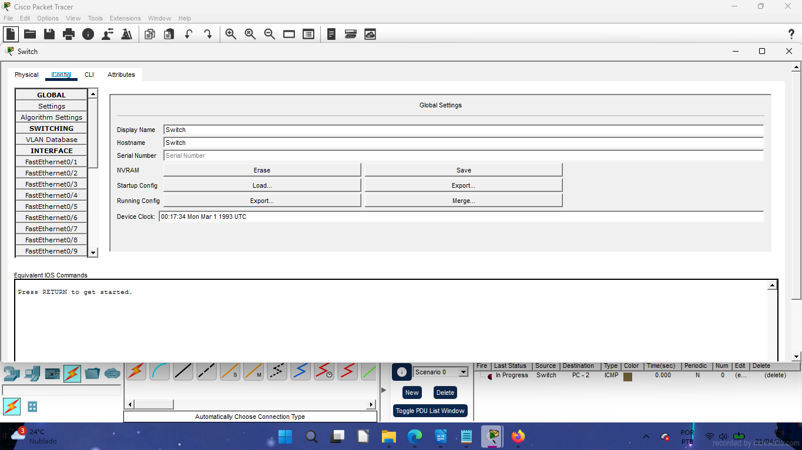
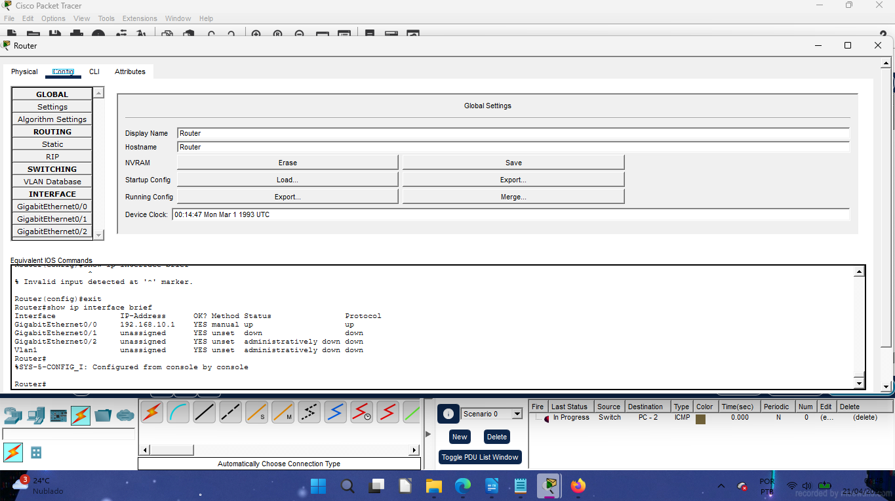
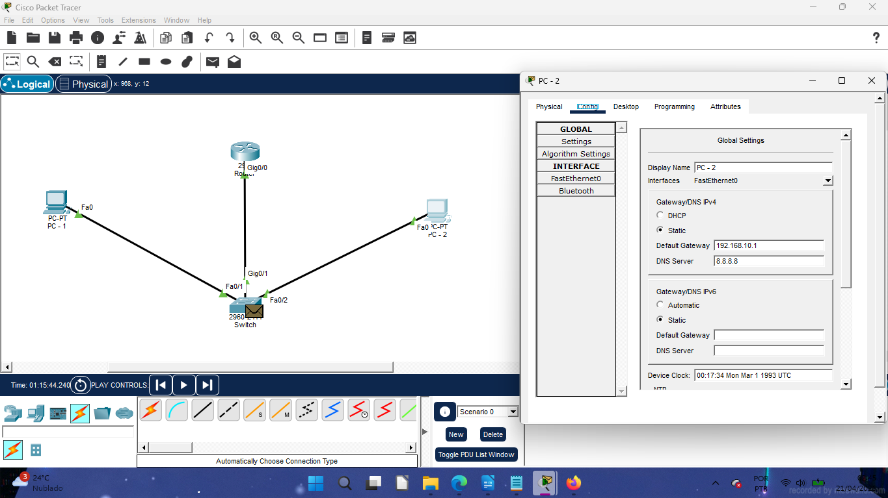
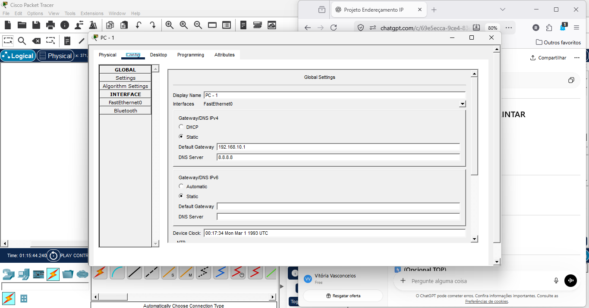

### Configuração do Roteador (CLI)
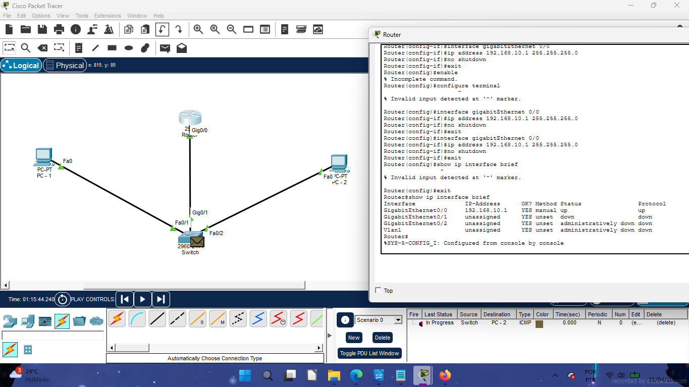

### Teste de Conectividade
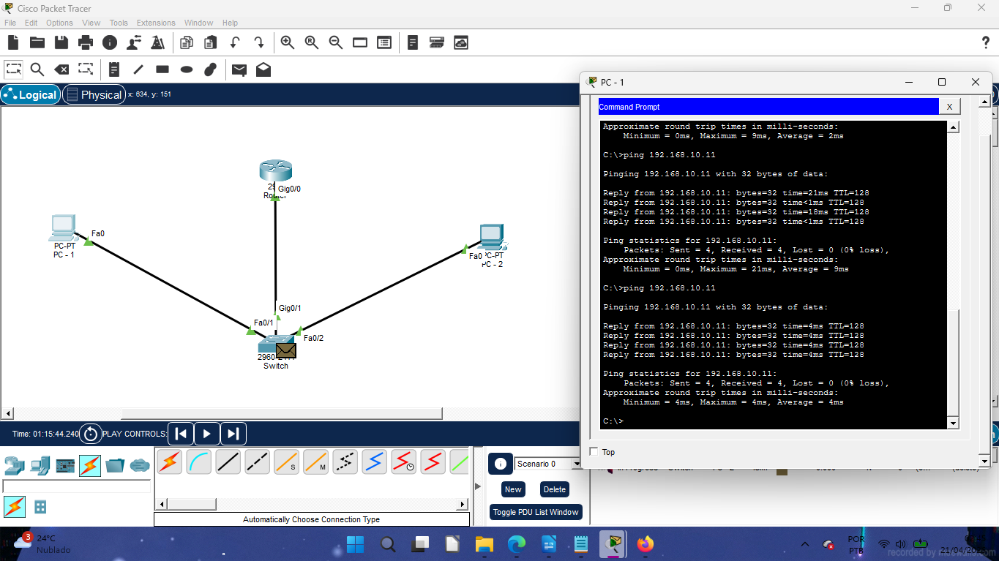
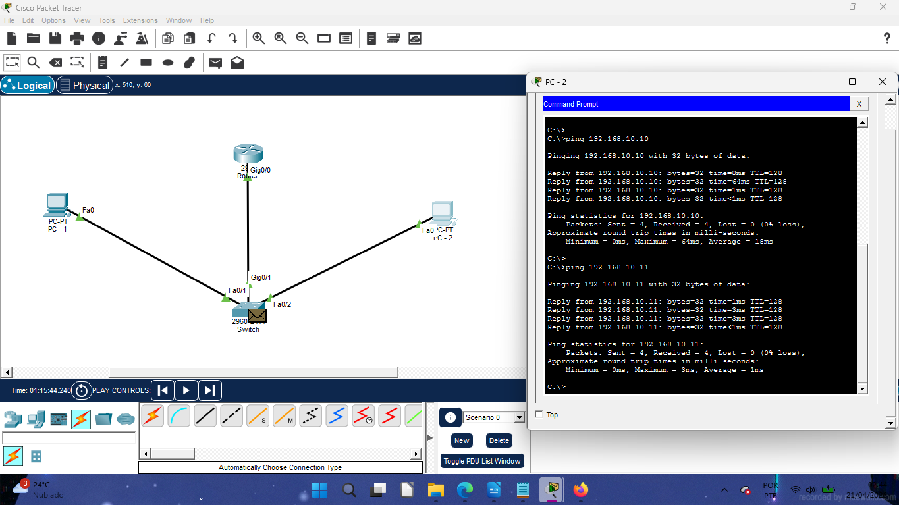

### Simulação de Pacotes
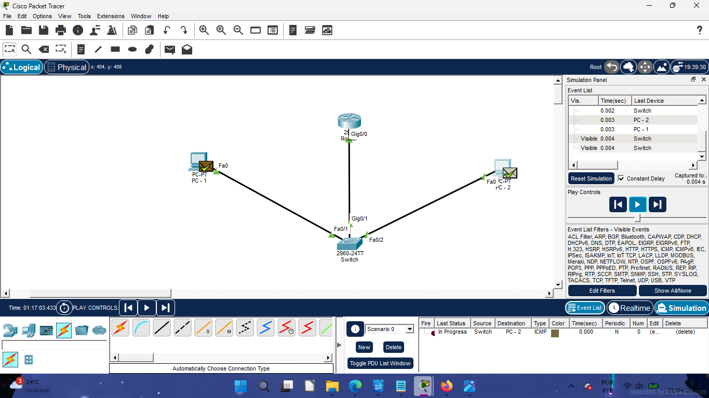

---

## Observações

Durante a simulação, foi possível observar que dispositivos na mesma rede se comunicam diretamente através do switch, sem a necessidade de roteamento.

Além disso, alguns pacotes apresentaram falha inicial no modo Simulation, comportamento esperado devido ao processo de resolução de endereços (ARP).

---

## Ferramentas Utilizadas

- Cisco Packet Tracer
- GitHub
- Markdown

---

## Autora

Vitória Ribeiro  
Estudante de Análise e Desenvolvimento de Sistemas 
